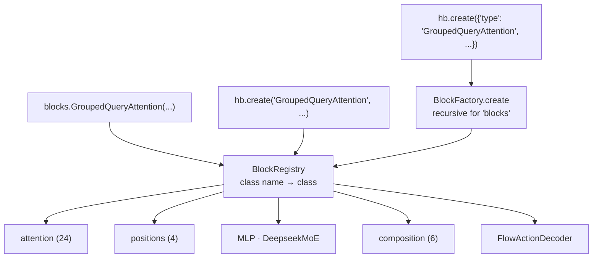
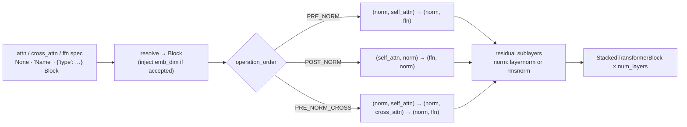
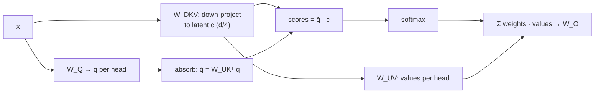
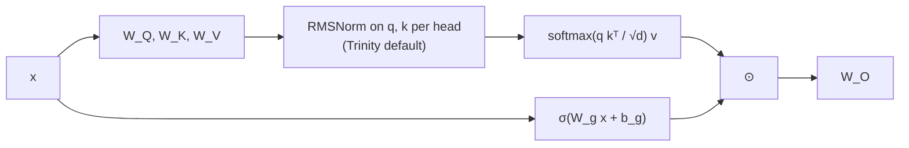
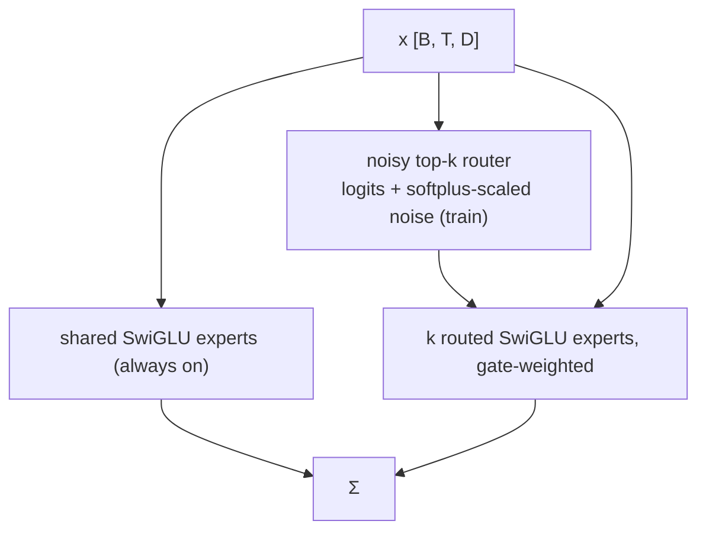
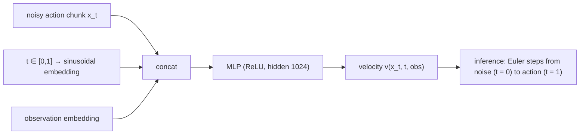

# Architecture

Mermaid diagrams (they render on GitHub). The same figures are used on the
[project page](../project-page/index.html) and in the [paper](../paper/main.tex).

## 1. One registry, three ways in

## 2. TransformerBlockBuilder

## 3. Multi-head latent attention (absorption)

## 4. Gated and Trinity attention

## 5. DeepSeek MoE

## 6. Flow-matching action decoder (VLA)

