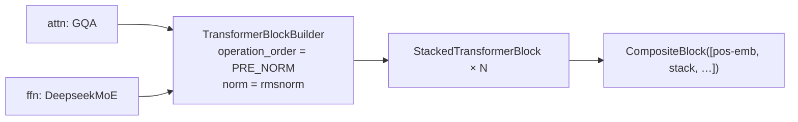

# Twenty-four attentions, one interface

*2026-09-28 · B A NaveenKumar*

> **Summary.** HaloBlocks (`pip install haloblocks`) is a PyTorch library where every layer
> (MHA, GQA, MLA, linear, sliding-window, gated attention, RoPE, ALiBi, DeepSeek MoE, a
> flow-matching action head) is a `Block` registered under its class name. You can create any
> of them directly, by name or from a config dict, and snap them together with a builder.
> Here is why that design is useful, and what writing the paper turned up.

## The problem: every attention has a different signature

Try swapping multi-head attention for grouped-query attention in a random codebase. The
constructor arguments differ, the mask convention differs, and sometimes the output is a
tuple. Research code tends to fork a whole model to change one layer.

HaloBlocks fixes the interface instead:

- every component subclasses `Block` (an `nn.Module`) with `forward(x, **kwargs)`;
- every class registers itself under its **class name**;
- three construction styles give the same object:

```python
blocks.GroupedQueryAttention(emb_dim=512, num_heads=8, num_kv_heads=2)
hb.create("GroupedQueryAttention", emb_dim=512, num_heads=8, num_kv_heads=2)
hb.create({"type": "GroupedQueryAttention", "emb_dim": 512, "num_heads": 8, "num_kv_heads": 2})
```

The third form is a plain dict, so a whole model can live in YAML and be swept.

## Layers from parts

`TransformerBlockBuilder` takes *any* attention, optional cross-attention, and *any* FFN,
plus an `operation_order` that says where the norms go:



A GQA + MoE layer at width 256 comes to 3.71M parameters, and a four-layer
Trinity-attention stack with sinusoidal positions to 3.42M. Both are a few lines of config.

## Three blocks worth a closer look

**Multi-head latent attention.** DeepSeek-V2's trick for a tiny KV cache: keys and values
come from a shared low-rank latent, and queries are multiplied by the key up-projection
("absorbed") so scores are computed directly against the latent.

**Gated / Trinity attention.** A sigmoid gate on the attention output, `σ(W_g x) ⊙ attn(x)`,
adds non-linearity and lets heads switch themselves off, which recent work links to removing
attention sinks. `TrinityAttention` adds QK-RMSNorm by default.

**FlowActionDecoder.** A small velocity-field network for flow-matching robot actions: it
takes the noisy action chunk, a sinusoidal time embedding and an observation embedding, and
predicts the velocity. It's the same head used in the Hale-VLA family.

## What writing the paper found

Documenting every block against its code surfaced three inconsistencies:

1. The README calls `TrinityAttention` "local + global + linear attention". The code is
   QK-normed softmax attention with an output gate.
2. `TransformerBlockBuilder(ffn="DeepseekMoE", ffn_kwargs=...)` crashes because default
   MLP kwargs leak into the MoE constructor. The dict form works.
3. The README's CI badge points at a workflow that doesn't exist.

None of these are hard to fix, and they're listed in the docs until they are. The test
suite (71 tests) passes.

Docs, API reference and paper: [github.com/basaanithanaveenkumar/HaloBlocks](https://github.com/basaanithanaveenkumar/HaloBlocks).
